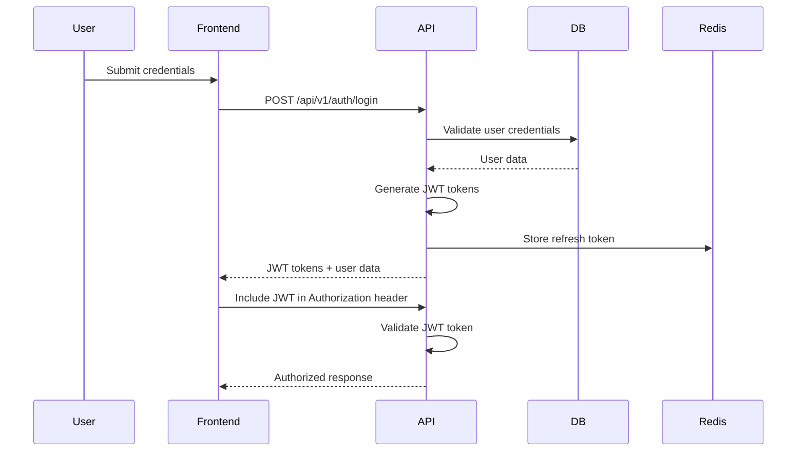
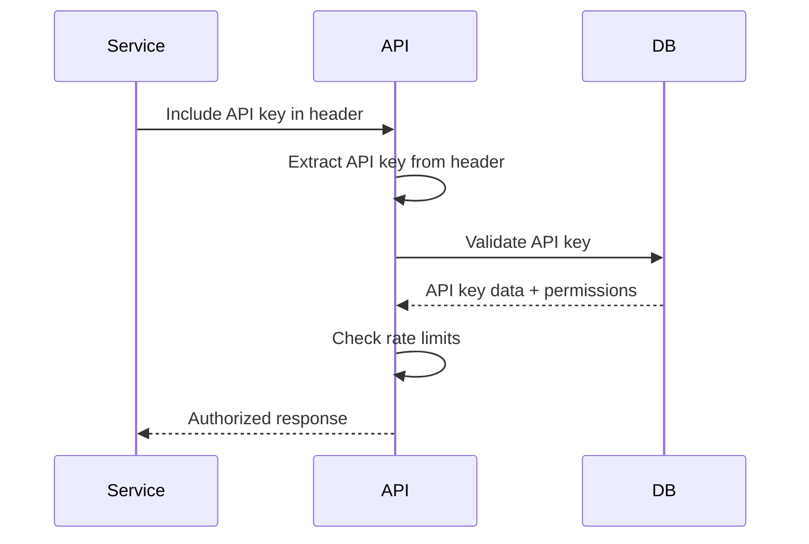
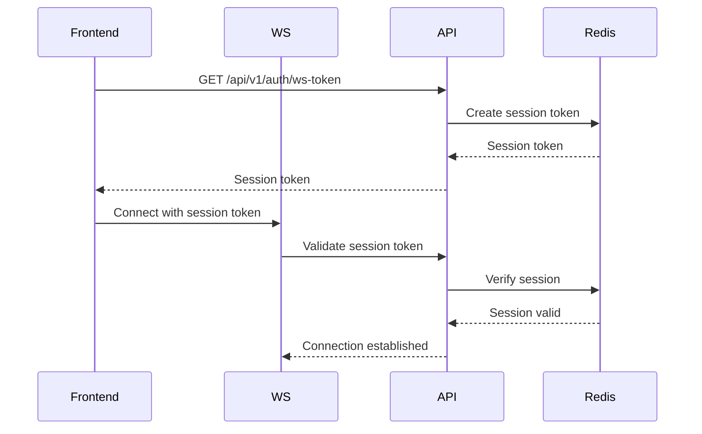

# Authentication and Authorization System Design

## Overview

This document outlines the comprehensive authentication and authorization system for the FastAPI-based BettaFish backend, providing secure access control while maintaining flexibility for different user types and use cases.

## Authentication Strategies

### 1. JWT-Based Authentication
Primary authentication method for API access and frontend users.

#### JWT Token Structure
```json
{
  "sub": "user_id",
  "email": "user@example.com",
  "role": "USER",
  "permissions": ["read:reports", "create:analysis"],
  "iat": 1640995200,
  "exp": 1640998800,
  "jti": "unique_token_id"
}
```

#### Token Types
1. **Access Token**: Short-lived (30 minutes) for API access
2. **Refresh Token**: Long-lived (7 days) for token renewal
3. **API Key Token**: Long-lived for external integrations

### 2. API Key Authentication
For external system integrations and service-to-service communication.

#### API Key Format
```json
{
  "key_id": "ak_123456789",
  "name": "Production API Key",
  "permissions": ["read:agents", "write:reports"],
  "created_at": "2024-01-01T00:00:00Z",
  "expires_at": "2024-12-31T23:59:59Z",
  "rate_limit": {
    "requests_per_minute": 100,
    "requests_per_hour": 1000
  }
}
```

### 3. Session-Based Authentication
For traditional web sessions and WebSocket connections.

#### Session Structure
```json
{
  "session_id": "sess_123456789",
  "user_id": "user_123",
  "created_at": "2024-01-01T12:00:00Z",
  "last_accessed": "2024-01-01T12:30:00Z",
  "csrf_token": "csrf_token_123"
}
```

## User Roles and Permissions

### Role Hierarchy
1. **ADMIN**: Full system access
   - Manage all users and agents
   - Access system configuration
   - View all reports and analysis
   - Manage API keys

2. **USER**: Standard user access
   - Create and manage own analysis tasks
   - View own reports
   - Start/stop agents (with limits)
   - Manage own API keys

3. **VIEWER**: Read-only access
   - View assigned reports
   - View agent status
   - No agent management capabilities

4. **SERVICE**: System integration access
   - Specific API endpoints only
   - Limited to configured permissions
   - No UI access

### Permission System
```python
# backend/core/permissions.py
from enum import Enum
from typing import List, Set

class Permission(Enum):
    # System permissions
    SYSTEM_READ = "system:read"
    SYSTEM_WRITE = "system:write"
    SYSTEM_CONFIG = "system:config"
    
    # Agent permissions
    AGENT_READ = "agent:read"
    AGENT_START = "agent:start"
    AGENT_STOP = "agent:stop"
    AGENT_CONFIG = "agent:config"
    
    # Report permissions
    REPORT_READ = "report:read"
    REPORT_CREATE = "report:create"
    REPORT_UPDATE = "report:update"
    REPORT_DELETE = "report:delete"
    REPORT_EXPORT = "report:export"
    
    # User permissions
    USER_READ = "user:read"
    USER_CREATE = "user:create"
    USER_UPDATE = "user:update"
    USER_DELETE = "user:delete"
    
    # API Key permissions
    APIKEY_READ = "apikey:read"
    APIKEY_CREATE = "apikey:create"
    APIKEY_UPDATE = "apikey:update"
    APIKEY_DELETE = "apikey:delete"

class RolePermissions:
    """Permission mappings for each role"""
    
    ADMIN_PERMISSIONS: Set[Permission] = {
        Permission.SYSTEM_READ,
        Permission.SYSTEM_WRITE,
        Permission.SYSTEM_CONFIG,
        Permission.AGENT_READ,
        Permission.AGENT_START,
        Permission.AGENT_STOP,
        Permission.AGENT_CONFIG,
        Permission.REPORT_READ,
        Permission.REPORT_CREATE,
        Permission.REPORT_UPDATE,
        Permission.REPORT_DELETE,
        Permission.REPORT_EXPORT,
        Permission.USER_READ,
        Permission.USER_CREATE,
        Permission.USER_UPDATE,
        Permission.USER_DELETE,
        Permission.APIKEY_READ,
        Permission.APIKEY_CREATE,
        Permission.APIKEY_UPDATE,
        Permission.APIKEY_DELETE,
    }
    
    USER_PERMISSIONS: Set[Permission] = {
        Permission.AGENT_READ,
        Permission.AGENT_START,
        Permission.AGENT_STOP,
        Permission.REPORT_READ,
        Permission.REPORT_CREATE,
        Permission.REPORT_UPDATE,
        Permission.USER_READ,
        Permission.USER_UPDATE,
        Permission.APIKEY_READ,
        Permission.APIKEY_CREATE,
        Permission.APIKEY_UPDATE,
    }
    
    VIEWER_PERMISSIONS: Set[Permission] = {
        Permission.AGENT_READ,
        Permission.REPORT_READ,
        Permission.USER_READ,
    }
    
    SERVICE_PERMISSIONS: Set[Permission] = {
        Permission.AGENT_READ,
        Permission.AGENT_START,
        Permission.REPORT_READ,
        Permission.REPORT_CREATE,
    }
```

## Authentication Flow

### 1. User Login Flow


### 2. API Key Authentication Flow


### 3. WebSocket Authentication Flow


## Security Implementation

### 1. Password Security
```python
# backend/core/security.py
from passlib.context import CryptContext
from passlib.hash import bcrypt
import secrets

pwd_context = CryptContext(
    schemes=["bcrypt"],
    deprecated="auto",
    bcrypt__rounds=12
)

def hash_password(password: str) -> str:
    """Hash password with bcrypt"""
    return pwd_context.hash(password)

def verify_password(password: str, hashed: str) -> bool:
    """Verify password against hash"""
    return pwd_context.verify(password, hashed)

def generate_password_reset_token() -> str:
    """Generate secure password reset token"""
    return secrets.token_urlsafe(32)
```

### 2. JWT Security
```python
# backend/core/jwt_handler.py
from datetime import datetime, timedelta
from typing import Dict, Any, Optional
from jose import jwt, JWTError

from .config import settings

class JWTHandler:
    @staticmethod
    def create_access_token(
        user_data: Dict[str, Any],
        expires_delta: Optional[timedelta] = None
    ) -> str:
        """Create JWT access token"""
        now = datetime.utcnow()
        
        if expires_delta is None:
            expires_delta = timedelta(minutes=settings.ACCESS_TOKEN_EXPIRE_MINUTES)
        
        expire = now + expires_delta
        
        payload = {
            "sub": user_data["id"],
            "email": user_data["email"],
            "role": user_data["role"],
            "permissions": user_data["permissions"],
            "iat": now,
            "exp": expire,
            "jti": f"access_{user_data['id']}_{now.timestamp()}"
        }
        
        return jwt.encode(
            payload,
            settings.SECRET_KEY,
            algorithm=settings.ALGORITHM
        )
    
    @staticmethod
    def create_refresh_token(user_id: str) -> str:
        """Create JWT refresh token"""
        now = datetime.utcnow()
        expire = now + timedelta(days=settings.REFRESH_TOKEN_EXPIRE_DAYS)
        
        payload = {
            "sub": user_id,
            "type": "refresh",
            "iat": now,
            "exp": expire,
            "jti": f"refresh_{user_id}_{now.timestamp()}"
        }
        
        return jwt.encode(
            payload,
            settings.SECRET_KEY,
            algorithm=settings.ALGORITHM
        )
    
    @staticmethod
    def verify_token(token: str) -> Optional[Dict[str, Any]]:
        """Verify JWT token"""
        try:
            payload = jwt.decode(
                token,
                settings.SECRET_KEY,
                algorithms=[settings.ALGORITHM]
            )
            return payload
        except JWTError:
            return None
    
    @staticmethod
    def decode_without_verification(token: str) -> Dict[str, Any]:
        """Decode JWT without verification (for debugging)"""
        return jwt.decode(
            token,
            options={"verify_signature": False},
            algorithms=[settings.ALGORITHM]
        )
```

### 3. Rate Limiting
```python
# backend/core/rate_limiter.py
from fastapi import HTTPException, Request
from slowapi import Limiter, _rate_limit_exceeded_handler
from typing import Callable
import asyncio

# Redis-based rate limiter
limiter = Limiter(key="rate_limit", redis_url="redis://localhost:6379")

@_rate_limit_exceeded_handler
async def rate_limit_exceeded_handler(request: Request, exc: HTTPException):
    """Custom rate limit exceeded handler"""
    return JSONResponse(
        status_code=429,
        content={
            "error": True,
            "message": "Rate limit exceeded",
            "retry_after": exc.retry_after
        }
    )

def create_rate_limiter(
    times: int = 100,
    seconds: int = 60
) -> Callable:
    """Create rate limiter decorator"""
    return limiter.limit(times, seconds)(create_rate_limiter.__name__)

# Usage
@app.post("/api/v1/analysis")
@create_rate_limiter(times=5, seconds=60)
async def create_analysis():
    """Rate limited endpoint"""
    pass
```

## Authorization Implementation

### 1. Permission Decorator
```python
# backend/core/authorization.py
from functools import wraps
from typing import Callable, List
from fastapi import HTTPException, Depends
from .jwt_handler import JWTHandler
from .permissions import Permission, RolePermissions

def require_permissions(permissions: List[Permission]):
    """Decorator to require specific permissions"""
    def decorator(func: Callable):
        @wraps(func)
        async def wrapper(*args, **kwargs):
            # Get user from dependency
            current_user = kwargs.get('current_user')
            if not current_user:
                raise HTTPException(
                    status_code=401,
                    detail="Authentication required"
                )
            
            # Check permissions
            user_permissions = set(current_user.get('permissions', []))
            required_permissions = set(permissions)
            
            if not required_permissions.issubset(user_permissions):
                raise HTTPException(
                    status_code=403,
                    detail=f"Required permissions: {', '.join(permissions)}"
                )
            
            return await func(*args, **kwargs)
        return wrapper
    return decorator

def require_role(role: str):
    """Decorator to require specific role"""
    def decorator(func: Callable):
        @wraps(func)
        async def wrapper(*args, **kwargs):
            current_user = kwargs.get('current_user')
            if not current_user or current_user.get('role') != role:
                raise HTTPException(
                    status_code=403,
                    detail=f"Role '{role}' required"
                )
            
            return await func(*args, **kwargs)
        return wrapper
    return decorator

# Usage
@app.get("/api/v1/admin/users")
@require_role("ADMIN")
@require_permissions([Permission.USER_READ, Permission.USER_UPDATE])
async def get_users(current_user: dict = Depends(get_current_user)):
    """Admin-only endpoint with permission checks"""
    pass
```

### 2. Resource-Based Authorization
```python
# backend/core/resource_auth.py
from typing import Dict, Any, Optional
from enum import Enum

class ResourceType(Enum):
    ANALYSIS_TASK = "analysis_task"
    REPORT = "report"
    AGENT = "agent"
    USER = "user"

class Action(Enum):
    CREATE = "create"
    READ = "read"
    UPDATE = "update"
    DELETE = "delete"
    START = "start"
    STOP = "stop"

async def check_resource_permission(
    user_id: str,
    resource_type: ResourceType,
    resource_id: str,
    action: Action
    prisma
) -> bool:
    """Check if user has permission for specific resource action"""
    
    # Get user permissions
    user = await prisma.user.find_unique(where={"id": user_id})
    if not user:
        return False
    
    user_permissions = set(user.permissions)
    
    # Check resource ownership and permissions
    if resource_type == ResourceType.ANALYSIS_TASK:
        if action == Action.READ:
            # Users can read their own analysis tasks
            task = await prisma.analysistask.find_unique(where={"id": resource_id})
            return task and task.userId == user_id
        
        elif action in [Action.UPDATE, Action.DELETE]:
            # Users can update/delete their own tasks
            task = await prisma.analysistask.find_unique(where={"id": resource_id})
            return task and task.userId == user_id
    
    elif resource_type == ResourceType.REPORT:
        if action == Action.READ:
            # Check report visibility
            report = await prisma.report.find_unique(where={"id": resource_id})
            return (
                report and (
                    report.userId == user_id or  # Owner can read
                    report.isPublic or         # Public reports can be read by anyone
                    Permission.REPORT_READ in user_permissions
                )
            )
    
    # Add more resource checks as needed...
    
    return False
```

## API Key Management

### 1. API Key Generation
```python
# backend/services/apikey_service.py
import secrets
import string
from datetime import datetime, timedelta

from ..core.database import get_prisma
from ..models.apikey import APIKey

class APIKeyService:
    def __init__(self, prisma):
        self.prisma = prisma
    
    async def create_api_key(
        self,
        name: str,
        permissions: List[str],
        expires_days: int = 365,
        rate_limit: Optional[Dict[str, int]] = None
    ) -> APIKey:
        """Generate new API key"""
        
        # Generate secure key
        key_id = f"ak_{secrets.token_urlsafe(8)}"
        key_value = secrets.token_urlsafe(32)
        
        # Calculate expiration
        expires_at = datetime.utcnow() + timedelta(days=expires_days)
        
        # Create API key record
        api_key = await self.prisma.apikey.create({
            "data": {
                "keyId": key_id,
                "name": name,
                "keyHash": self._hash_api_key(key_value),
                "permissions": permissions,
                "rateLimitPerMinute": rate_limit.get("requests_per_minute", 100) if rate_limit else None,
                "rateLimitPerHour": rate_limit.get("requests_per_hour", 1000) if rate_limit else None,
                "createdAt": datetime.utcnow(),
                "expiresAt": expires_at,
            }
        }
        })
        
        return APIKey(
            id=api_key.id,
            keyId=key_id,
            keyValue=key_value,
            name=name,
            permissions=permissions,
            expiresAt=expires_at
        )
    
    def _hash_api_key(self, key: str) -> str:
        """Hash API key for secure storage"""
        import hashlib
        return hashlib.sha256(key.encode()).hexdigest()
```

### 2. API Key Validation Middleware
```python
# backend/middleware/apikey_auth.py
from fastapi import HTTPException, Request
from typing import Callable, Optional
from starlette.middleware.base import BaseHTTPMiddleware

from ..core.database import get_prisma
from ..services.apikey_service import APIKeyService

class APIKeyAuthMiddleware(BaseHTTPMiddleware):
    def __init__(self, app, apikey_service: APIKeyService):
        self.app = app
        self.apikey_service = apikey_service
    
    async def dispatch(self, request: Request, call_next: Callable):
        # Skip auth for certain endpoints
        if self._should_skip_auth(request.url.path):
            response = await call_next(request)
            return response
        
        # Extract API key from header
        api_key = request.headers.get("X-API-Key")
        if not api_key:
            raise HTTPException(
                status_code=401,
                detail="API key required"
            )
        
        # Validate API key
        key_data = await self.apikey_service.validate_api_key(api_key)
        if not key_data:
            raise HTTPException(
                status_code=401,
                detail="Invalid or expired API key"
            )
        
        # Add key data to request state
        request.state.api_key = key_data
        
        response = await call_next(request)
        return response
    
    def _should_skip_auth(self, path: str) -> bool:
        """Check if path should skip authentication"""
        skip_paths = [
            "/api/v1/auth/login",
            "/api/v1/auth/register",
            "/health",
            "/docs"
        ]
        return any(path.startswith(skip_path) for skip_path in skip_paths)
```

## Session Management

### 1. Redis Session Store
```python
# backend/core/session_store.py
import json
import uuid
from datetime import datetime, timedelta
from typing import Dict, Any, Optional

import redis.asyncio as redis
from ..core.config import settings

class SessionStore:
    def __init__(self):
        self.redis = redis.from_url(settings.REDIS_URL)
        self.default_expiry = timedelta(hours=24)
    
    async def create_session(
        self,
        user_id: str,
        data: Optional[Dict[str, Any]] = None
    ) -> str:
        """Create new session"""
        session_id = str(uuid.uuid4())
        session_data = {
            "user_id": user_id,
            "created_at": datetime.utcnow().isoformat(),
            "last_accessed": datetime.utcnow().isoformat(),
            "data": data or {}
        }
        
        # Store in Redis with expiry
        await self.redis.setex(
            f"session:{session_id}",
            json.dumps(session_data),
            self.default_expiry
        )
        
        return session_id
    
    async def get_session(self, session_id: str) -> Optional[Dict[str, Any]]:
        """Get session data"""
        data = await self.redis.get(f"session:{session_id}")
        if data:
            return json.loads(data)
        return None
    
    async def update_session(
        self,
        session_id: str,
        data: Dict[str, Any]
    ) -> None:
        """Update session data"""
        existing_data = await self.get_session(session_id) or {}
        existing_data.update(data)
        existing_data["last_accessed"] = datetime.utcnow().isoformat()
        
        await self.redis.setex(
            f"session:{session_id}",
            json.dumps(existing_data),
            self.default_expiry
        )
    
    async def delete_session(self, session_id: str) -> None:
        """Delete session"""
        await self.redis.delete(f"session:{session_id}")
```

## Security Headers and CORS

### 1. Security Headers Middleware
```python
# backend/middleware/security_headers.py
from fastapi import Response
from starlette.middleware.base import BaseHTTPMiddleware
from typing import Callable

class SecurityHeadersMiddleware(BaseHTTPMiddleware):
    def __init__(self, app):
        self.app = app
    
    async def dispatch(self, request, call_next):
        response = await call_next(request)
        
        # Add security headers
        response.headers["X-Content-Type-Options"] = "nosniff"
        response.headers["X-Frame-Options"] = "DENY"
        response.headers["X-XSS-Protection"] = "1; mode=block"
        response.headers["Strict-Transport-Security"] = "max-age=31536000; includeSubDomains"
        response.headers["Content-Security-Policy"] = "default-src 'self'"
        
        return response
```

### 2. CORS Configuration
```python
# backend/core/cors.py
from fastapi.middleware.cors import CORSMiddleware
from typing import List

def get_cors_middleware(allowed_origins: List[str]):
    """Get CORS middleware with proper configuration"""
    return CORSMiddleware(
        allow_origins=allowed_origins,
        allow_credentials=True,
        allow_methods=["GET", "POST", "PUT", "DELETE", "OPTIONS"],
        allow_headers=[
            "Authorization",
            "X-API-Key",
            "Content-Type",
            "X-Requested-With"
        ],
        expose_headers=["X-Total-Count"],
        max_age=600,
    )
```

This authentication and authorization system provides comprehensive security for the FastAPI-based BettaFish backend, ensuring secure access control while maintaining flexibility for different user types and integration scenarios.