# Error Handling and Validation Layers for BettaFish

## Overview

This document outlines the comprehensive error handling and validation strategy for the FastAPI-based BettaFish backend. The system provides robust error handling, input validation, and consistent error responses across all API endpoints.

## Error Handling Architecture

### Error Types and Categories

```mermaid
graph TD
    A[Error Handling System] --> B[Validation Errors]
    A --> C[Authentication Errors]
    A --> D[Authorization Errors]
    A --> E[Business Logic Errors]
    A --> F[External Service Errors]
    A --> G[Database Errors]
    A --> H[System Errors]
    
    B --> B1[Invalid Input]
    B --> B2[Missing Required Fields]
    B --> B3[Format Validation]
    
    C --> C1[Invalid Credentials]
    C --> C2[Expired Tokens]
    C --> C3[Missing Authentication]
    
    D --> D1[Insufficient Permissions]
    D2[Resource Access Denied]
    
    E --> E1[Agent Not Available]
    E --> E2[Invalid Analysis Request]
    E3[Resource Limits Exceeded]
    
    F --> F1[LLM Service Errors]
    F --> F2[Search API Errors]
    F --> F3[External Database Errors]
    
    G --> G1[Connection Errors]
    G --> G2[Query Errors]
    G --> G3[Constraint Violations]
    
    H --> H1[Server Errors]
    H --> H2[Memory Issues]
    H --> H3[Timeout Errors]
```



### Error Response Structure

```python
# backend/core/exceptions.py
from typing import Any, Dict, List, Optional
from fastapi import HTTPException, status
from pydantic import BaseModel, Field

class ErrorDetail(BaseModel):
    field: Optional[str] = None
    message: str
    code: Optional[str] = None

class ErrorResponse(BaseModel):
    success: bool = False
    error: str = Field(..., description="Error type/category")
    message: str = Field(..., description="Human-readable error message")
    code: Optional[str] = Field(None, description="Machine-readable error code")
    details: Optional[List[ErrorDetail]] = Field(None, description="Validation error details")
    timestamp: str = Field(..., description="Error timestamp")
    request_id: Optional[str] = Field(None, description="Request tracking ID")
    stack_trace: Optional[str] = Field(None, description="Stack trace (debug mode only)")

class BettaFishException(Exception):
    """Base exception for BettaFish application"""
    
    def __init__(
        self,
        message: str,
        error_code: Optional[str] = None,
        status_code: int = status.HTTP_500_INTERNAL_SERVER_ERROR,
        details: Optional[List[ErrorDetail]] = None
    ):
        self.message = message
        self.error_code = error_code
        self.status_code = status_code
        self.details = details
        super().__init__(message)

class ValidationException(BettaFishException):
    """Validation error exception"""
    
    def __init__(
        self,
        message: str = "Validation failed",
        details: Optional[List[ErrorDetail]] = None,
        error_code: Optional[str] = "VALIDATION_ERROR"
    ):
        super().__init__(
            message=message,
            error_code=error_code,
            status_code=status.HTTP_422_UNPROCESSABLE_ENTITY,
            details=details
        )

class AuthenticationException(BettaFishException):
    """Authentication error exception"""
    
    def __init__(
        self,
        message: str = "Authentication failed",
        error_code: Optional[str] = "AUTHENTICATION_ERROR"
    ):
        super().__init__(
            message=message,
            error_code=error_code,
            status_code=status.HTTP_401_UNAUTHORIZED
        )

class AuthorizationException(BettaFishException):
    """Authorization error exception"""
    
    def __init__(
        self,
        message: str = "Access denied",
        error_code: Optional[str] = "AUTHORIZATION_ERROR"
    ):
        super().__init__(
            message=message,
            error_code=error_code,
            status_code=status.HTTP_403_FORBIDDEN
        )

class ResourceNotFoundException(BettaFishException):
    """Resource not found exception"""
    
    def __init__(
        self,
        resource: str = "Resource",
        error_code: Optional[str] = "RESOURCE_NOT_FOUND"
    ):
        super().__init__(
            message=f"{resource} not found",
            error_code=error_code,
            status_code=status.HTTP_404_NOT_FOUND
        )

class BusinessLogicException(BettaFishException):
    """Business logic error exception"""
    
    def __init__(
        self,
        message: str,
        error_code: Optional[str] = "BUSINESS_LOGIC_ERROR",
        status_code: int = status.HTTP_400_BAD_REQUEST
    ):
        super().__init__(
            message=message,
            error_code=error_code,
            status_code=status_code
        )

class ExternalServiceException(BettaFishException):
    """External service error exception"""
    
    def __init__(
        self,
        service: str,
        message: str = "External service error",
        error_code: Optional[str] = "EXTERNAL_SERVICE_ERROR"
    ):
        super().__init__(
            message=f"{service}: {message}",
            error_code=error_code,
            status_code=status.HTTP_502_BAD_GATEWAY
        )
```

### Global Exception Handler

```python
# backend/core/error_handlers.py
import traceback
from datetime import datetime
from typing import Union

from fastapi import Request, Response
from fastapi.responses import JSONResponse
from starlette.middleware.base import BaseHTTPMiddleware

from .config import settings
from .exceptions import (
    BettaFishException,
    ErrorResponse,
    ErrorDetail
)

class ErrorHandlingMiddleware(BaseHTTPMiddleware):
    """Global error handling middleware"""
    
    async def dispatch(self, request: Request, call_next):
        try:
            response = await call_next(request)
            return response
        except Exception as exc:
            return await self._handle_exception(request, exc)
    
    async def _handle_exception(self, request: Request, exc: Exception) -> JSONResponse:
        """Handle exceptions and return appropriate error response"""
        
        # Generate request ID for tracking
        request_id = getattr(request.state, "request_id", None)
        
        # Handle BettaFish exceptions
        if isinstance(exc, BettaFishException):
            error_response = ErrorResponse(
                error=exc.__class__.__name__,
                message=exc.message,
                code=exc.error_code,
                details=exc.details,
                timestamp=datetime.utcnow().isoformat(),
                request_id=request_id,
                stack_trace=traceback.format_exc() if settings.DEBUG else None
            )
            
            return JSONResponse(
                status_code=exc.status_code,
                content=error_response.dict()
            )
        
        # Handle HTTP exceptions
        if isinstance(exc, HTTPException):
            error_response = ErrorResponse(
                error="HTTPException",
                message=exc.detail,
                code=str(exc.status_code),
                timestamp=datetime.utcnow().isoformat(),
                request_id=request_id,
                stack_trace=traceback.format_exc() if settings.DEBUG else None
            )
            
            return JSONResponse(
                status_code=exc.status_code,
                content=error_response.dict()
            )
        
        # Handle unexpected exceptions
        error_response = ErrorResponse(
            error="InternalServerError",
            message="An unexpected error occurred",
            code="INTERNAL_SERVER_ERROR",
            timestamp=datetime.utcnow().isoformat(),
            request_id=request_id,
            stack_trace=traceback.format_exc() if settings.DEBUG else None
        )
        
        return JSONResponse(
            status_code=status.HTTP_500_INTERNAL_SERVER_ERROR,
            content=error_response.dict()
        )

# Exception handlers for FastAPI
async def betta_fish_exception_handler(request: Request, exc: BettaFishException) -> JSONResponse:
    """Handler for BettaFish exceptions"""
    request_id = getattr(request.state, "request_id", None)
    
    error_response = ErrorResponse(
        error=exc.__class__.__name__,
        message=exc.message,
        code=exc.error_code,
        details=exc.details,
        timestamp=datetime.utcnow().isoformat(),
        request_id=request_id,
        stack_trace=traceback.format_exc() if settings.DEBUG else None
    )
    
    return JSONResponse(
        status_code=exc.status_code,
        content=error_response.dict()
    )

async def validation_exception_handler(request: Request, exc: Exception) -> JSONResponse:
    """Handler for validation exceptions"""
    request_id = getattr(request.state, "request_id", None)
    
    # Extract validation details if available
    details = []
    if hasattr(exc, 'errors'):
        for error in exc.errors():
            field = '.'.join(str(loc) for loc in error['loc'])
            details.append(ErrorDetail(
                field=field,
                message=error['msg'],
                code=error['type']
            ))
    
    error_response = ErrorResponse(
        error="ValidationError",
        message="Validation failed",
        code="VALIDATION_ERROR",
        details=details,
        timestamp=datetime.utcnow().isoformat(),
        request_id=request_id,
        stack_trace=traceback.format_exc() if settings.DEBUG else None
    )
    
    return JSONResponse(
        status_code=status.HTTP_422_UNPROCESSABLE_ENTITY,
        content=error_response.dict()
    )
```

## Input Validation

### Pydantic Models for Validation

```python
# backend/models/validation.py
from typing import List, Optional, Dict, Any, Union
from datetime import datetime
from pydantic import BaseModel, Field, validator, EmailStr
from enum import Enum

class AnalysisType(str, Enum):
    INSIGHT = "insight"
    MEDIA = "media"
    QUERY = "query"
    REPORT = "report"

class AgentStatus(str, Enum):
    IDLE = "idle"
    STARTING = "starting"
    RUNNING = "running"
    STOPPING = "stopping"
    STOPPED = "stopped"
    ERROR = "error"

class BaseRequest(BaseModel):
    """Base model for all requests"""
    class Config:
        extra = "forbid"  # Reject unknown fields

class InsightAnalysisRequest(BaseRequest):
    """Request model for insight analysis"""
    query: str = Field(..., min_length=1, max_length=1000, description="Analysis query")
    platforms: Optional[List[str]] = Field(None, description="Social media platforms to analyze")
    max_results: Optional[int] = Field(100, ge=1, le=1000, description="Maximum results to return")
    sentiment_analysis: Optional[bool] = Field(True, description="Enable sentiment analysis")
    language: Optional[str] = Field("en", description="Analysis language")
    
    @validator('query')
    def validate_query(cls, v):
        if not v.strip():
            raise ValueError("Query cannot be empty")
        return v.strip()
    
    @validator('platforms')
    def validate_platforms(cls, v):
        if v:
            valid_platforms = [
                'weibo', 'douyin', 'xiaohongshu', 'bilibili', 
                'zhihu', 'tieba', 'twitter', 'facebook', 'instagram'
            ]
            invalid_platforms = [p for p in v if p not in valid_platforms]
            if invalid_platforms:
                raise ValueError(f"Invalid platforms: {', '.join(invalid_platforms)}")
        return v

class MediaAnalysisRequest(BaseRequest):
    """Request model for media analysis"""
    query: str = Field(..., min_length=1, max_length=1000, description="Analysis query")
    time_range: Optional[str] = Field("24h", description="Time range for search")
    include_images: Optional[bool] = Field(True, description="Include image analysis")
    include_videos: Optional[bool] = Field(True, description="Include video analysis")
    max_results: Optional[int] = Field(50, ge=1, le=500, description="Maximum results to return")
    
    @validator('time_range')
    def validate_time_range(cls, v):
        valid_ranges = ['1h', '24h', '7d', '30d', '90d']
        if v not in valid_ranges:
            raise ValueError(f"Invalid time range. Must be one of: {', '.join(valid_ranges)}")
        return v

class QueryAnalysisRequest(BaseRequest):
    """Request model for query analysis"""
    query: str = Field(..., min_length=1, max_length=1000, description="Analysis query")
    optimization_level: Optional[str] = Field("standard", description="Query optimization level")
    max_results: Optional[int] = Field(100, ge=1, le=1000, description="Maximum results to return")
    include_sources: Optional[List[str]] = Field(None, description="Specific sources to include")
    
    @validator('optimization_level')
    def validate_optimization_level(cls, v):
        valid_levels = ['basic', 'standard', 'advanced']
        if v not in valid_levels:
            raise ValueError(f"Invalid optimization level. Must be one of: {', '.join(valid_levels)}")
        return v

class ReportGenerationRequest(BaseRequest):
    """Request model for report generation"""
    task_ids: List[str] = Field(..., min_items=1, description="List of analysis task IDs")
    template: Optional[str] = Field("auto", description="Report template")
    format: Optional[str] = Field("html", description="Report format")
    include_charts: Optional[bool] = Field(True, description="Include charts and visualizations")
    
    @validator('template')
    def validate_template(cls, v):
        valid_templates = ['auto', 'executive_summary', 'technical_analysis', 'public_opinion']
        if v not in valid_templates:
            raise ValueError(f"Invalid template. Must be one of: {', '.join(valid_templates)}")
        return v
    
    @validator('format')
    def validate_format(cls, v):
        valid_formats = ['html', 'pdf', 'markdown']
        if v not in valid_formats:
            raise ValueError(f"Invalid format. Must be one of: {', '.join(valid_formats)}")
        return v

class UserRegistrationRequest(BaseRequest):
    """Request model for user registration"""
    email: EmailStr = Field(..., description="User email")
    password: str = Field(..., min_length=8, max_length=128, description="User password")
    name: str = Field(..., min_length=1, max_length=100, description="User name")
    organization: Optional[str] = Field(None, max_length=200, description="User organization")
    
    @validator('password')
    def validate_password(cls, v):
        if not any(c.isupper() for c in v):
            raise ValueError("Password must contain at least one uppercase letter")
        if not any(c.islower() for c in v):
            raise ValueError("Password must contain at least one lowercase letter")
        if not any(c.isdigit() for c in v):
            raise ValueError("Password must contain at least one digit")
        return v

class UserLoginRequest(BaseRequest):
    """Request model for user login"""
    email: EmailStr = Field(..., description="User email")
    password: str = Field(..., description="User password")
    remember_me: Optional[bool] = Field(False, description="Remember login")
```

### Custom Validators

```python
# backend/core/validators.py
import re
from typing import Any, Dict, List
from pydantic import validator

class CustomValidators:
    """Custom validation functions"""
    
    @staticmethod
    def validate_task_id(task_id: str) -> str:
        """Validate task ID format"""
        pattern = r'^[a-zA-Z0-9_-]{8,64}$'
        if not re.match(pattern, task_id):
            raise ValueError("Invalid task ID format")
        return task_id
    
    @staticmethod
    def validate_agent_type(agent_type: str) -> str:
        """Validate agent type"""
        valid_types = ['insight', 'media', 'query', 'report']
        if agent_type not in valid_types:
            raise ValueError(f"Invalid agent type. Must be one of: {', '.join(valid_types)}")
        return agent_type
    
    @staticmethod
    def validate_language_code(language: str) -> str:
        """Validate language code"""
        pattern = r'^[a-z]{2}(-[A-Z]{2})?$'
        if not re.match(pattern, language):
            raise ValueError("Invalid language code format")
        return language
    
    @staticmethod
    def validate_date_range(start_date: str, end_date: str) -> tuple:
        """Validate date range"""
        try:
            start = datetime.fromisoformat(start_date.replace('Z', '+00:00'))
            end = datetime.fromisoformat(end_date.replace('Z', '+00:00'))
        except ValueError:
            raise ValueError("Invalid date format. Use ISO 8601 format")
        
        if start >= end:
            raise ValueError("Start date must be before end date")
        
        if (end - start).days > 365:
            raise ValueError("Date range cannot exceed 365 days")
        
        return start, end
    
    @staticmethod
    def validate_file_size(file_size: int, max_size_mb: int = 10) -> int:
        """Validate file size"""
        max_size_bytes = max_size_mb * 1024 * 1024
        if file_size > max_size_bytes:
            raise ValueError(f"File size cannot exceed {max_size_mb}MB")
        return file_size
    
    @staticmethod
    def validate_pagination(page: int, page_size: int) -> tuple:
        """Validate pagination parameters"""
        if page < 1:
            raise ValueError("Page number must be at least 1")
        if page_size < 1 or page_size > 100:
            raise ValueError("Page size must be between 1 and 100")
        return page, page_size
```

## API Endpoint Validation

### Dependency Injection for Validation

```python
# backend/core/dependencies.py
from typing import Optional
from fastapi import Depends, HTTPException, status, Query, Path
from fastapi.security import HTTPBearer, HTTPAuthorizationCredentials
from jose import JWTError, jwt

from .config import settings
from .database import get_prisma
from .exceptions import AuthenticationException, AuthorizationException
from .validators import CustomValidators

security = HTTPBearer()

async def get_current_user(
    credentials: HTTPAuthorizationCredentials = Depends(security),
    prisma = Depends(get_prisma)
) -> dict:
    """Get current authenticated user"""
    
    try:
        payload = jwt.decode(
            credentials.credentials,
            settings.JWT_SECRET_KEY,
            algorithms=[settings.JWT_ALGORITHM]
        )
        user_id: str = payload.get("sub")
        if user_id is None:
            raise AuthenticationException("Invalid token")
    except JWTError:
        raise AuthenticationException("Invalid token")
    
    user = await prisma.user.find_unique(where={"id": user_id})
    if user is None:
        raise AuthenticationException("User not found")
    
    if not user.isActive:
        raise AuthenticationException("User account is inactive")
    
    return user

async def get_current_active_user(
    current_user: dict = Depends(get_current_user)
) -> dict:
    """Get current active user"""
    return current_user

async def get_admin_user(
    current_user: dict = Depends(get_current_user)
) -> dict:
    """Get current admin user"""
    if current_user["role"] != "admin":
        raise AuthorizationException("Admin access required")
    return current_user

def validate_task_id(
    task_id: str = Path(..., description="Task ID")
) -> str:
    """Validate task ID parameter"""
    return CustomValidators.validate_task_id(task_id)

def validate_agent_type(
    agent_type: str = Path(..., description="Agent type")
) -> str:
    """Validate agent type parameter"""
    return CustomValidators.validate_agent_type(agent_type)

def validate_pagination(
    page: int = Query(1, ge=1, description="Page number"),
    page_size: int = Query(20, ge=1, le=100, description="Page size")
) -> tuple:
    """Validate pagination parameters"""
    return CustomValidators.validate_pagination(page, page_size)

def validate_date_range(
    start_date: Optional[str] = Query(None, description="Start date (ISO 8601)"),
    end_date: Optional[str] = Query(None, description="End date (ISO 8601)")
) -> Optional[tuple]:
    """Validate date range parameters"""
    if start_date and end_date:
        return CustomValidators.validate_date_range(start_date, end_date)
    return None
```

### Endpoint Implementation with Validation

```python
# backend/api/engines/insight.py
from fastapi import APIRouter, Depends, HTTPException, status
from typing import List, Dict, Any

from ...core.database import get_prisma
from ...core.dependencies import (
    get_current_active_user,
    validate_pagination,
    validate_date_range
)
from ...core.exceptions import (
    ValidationException,
    BusinessLogicException,
    ResourceNotFoundException
)
from ...models.validation import InsightAnalysisRequest
from ...models.responses import InsightResponse, InsightStatusResponse
from ...engines.insight.agent import InsightAgent

router = APIRouter(prefix="/engines/insight", tags=["insight"])

@router.post("/analyze", response_model=InsightResponse)
async def analyze_insight(
    request: InsightAnalysisRequest,
    user: dict = Depends(get_current_active_user),
    prisma = Depends(get_prisma)
):
    """Start insight analysis with validation"""
    
    # Check if user has permission to start analysis
    if user["role"] not in ["user", "admin"]:
        raise AuthorizationException("Insufficient permissions")
    
    # Check if agent is available
    agent = await prisma.agent.find_unique(where={"type": "insight"})
    if not agent or agent["status"] != "idle":
        raise BusinessLogicException("Insight agent is not available")
    
    # Check user's analysis quota
    user_analyses = await prisma.analysistask.count(
        where={
            "userId": user["id"],
            "createdAt": {"gte": datetime.utcnow().replace(day=1)}
        }
    )
    
    if user_analyses >= user["monthlyQuota"]:
        raise BusinessLogicException("Monthly analysis quota exceeded")
    
    try:
        # Create agent instance and start analysis
        insight_agent = InsightAgent(agent)
        task_id = await insight_agent.start_analysis(request.query, user["id"])
        
        return InsightResponse(
            taskId=task_id,
            status="started",
            message="Insight analysis started successfully"
        )
        
    except Exception as e:
        raise BusinessLogicException(f"Failed to start insight analysis: {str(e)}")

@router.get("/status/{task_id}", response_model=InsightStatusResponse)
async def get_insight_status(
    task_id: str = Depends(validate_task_id),
    user: dict = Depends(get_current_active_user),
    prisma = Depends(get_prisma)
):
    """Get insight analysis status with validation"""
    
    # Get task and verify ownership
    task = await prisma.analysistask.find_first(
        where={
            "id": task_id,
            "userId": user["id"],
            "agentType": "insight"
        }
    )
    
    if not task:
        raise ResourceNotFoundException("Analysis task")
    
    return InsightStatusResponse(
        taskId=task_id,
        status=task["status"],
        createdAt=task["createdAt"],
        updatedAt=task["updatedAt"],
        progress=task.get("progress", 0),
        errorMessage=task.get("errorMessage")
    )

@router.get("/results/{task_id}")
async def get_insight_results(
    task_id: str = Depends(validate_task_id),
    user: dict = Depends(get_current_active_user),
    prisma = Depends(get_prisma)
):
    """Get insight analysis results with validation"""
    
    # Get task and verify ownership
    task = await prisma.analysistask.find_first(
        where={
            "id": task_id,
            "userId": user["id"],
            "agentType": "insight"
        }
    )
    
    if not task:
        raise ResourceNotFoundException("Analysis task")
    
    if task["status"] != "completed":
        raise BusinessLogicException("Analysis task not completed")
    
    # Get results
    result = await prisma.analysisresult.find_first(
        where={
            "taskId": task_id,
            "agentType": "insight"
        }
    )
    
    if not result:
        raise ResourceNotFoundException("Analysis result")
    
    return result["results"]
```

## Error Logging and Monitoring

### Structured Error Logging

```python
# backend/core/logging.py
import logging
import json
from datetime import datetime
from typing import Dict, Any, Optional

from .config import settings

class StructuredLogger:
    """Structured logger for consistent error logging"""
    
    def __init__(self, name: str):
        self.logger = logging.getLogger(name)
        self.logger.setLevel(logging.INFO)
        
        # Configure handler
        handler = logging.StreamHandler()
        formatter = logging.Formatter('%(message)s')
        handler.setFormatter(formatter)
        self.logger.addHandler(handler)
    
    def log_error(
        self,
        error: Exception,
        context: Optional[Dict[str, Any]] = None,
        user_id: Optional[str] = None,
        request_id: Optional[str] = None
    ):
        """Log structured error information"""
        
        log_data = {
            "timestamp": datetime.utcnow().isoformat(),
            "level": "ERROR",
            "error_type": error.__class__.__name__,
            "error_message": str(error),
            "context": context or {},
            "user_id": user_id,
            "request_id": request_id,
            "service": "bettafish-api"
        }
        
        if settings.DEBUG:
            log_data["stack_trace"] = traceback.format_exc()
        
        self.logger.error(json.dumps(log_data))
    
    def log_warning(
        self,
        message: str,
        context: Optional[Dict[str, Any]] = None,
        user_id: Optional[str] = None,
        request_id: Optional[str] = None
    ):
        """Log structured warning information"""
        
        log_data = {
            "timestamp": datetime.utcnow().isoformat(),
            "level": "WARNING",
            "message": message,
            "context": context or {},
            "user_id": user_id,
            "request_id": request_id,
            "service": "bettafish-api"
        }
        
        self.logger.warning(json.dumps(log_data))
    
    def log_info(
        self,
        message: str,
        context: Optional[Dict[str, Any]] = None,
        user_id: Optional[str] = None,
        request_id: Optional[str] = None
    ):
        """Log structured information"""
        
        log_data = {
            "timestamp": datetime.utcnow().isoformat(),
            "level": "INFO",
            "message": message,
            "context": context or {},
            "user_id": user_id,
            "request_id": request_id,
            "service": "bettafish-api"
        }
        
        self.logger.info(json.dumps(log_data))

# Global logger instance
error_logger = StructuredLogger("bettafish.errors")
```

### Error Monitoring Integration

```python
# backend/core/monitoring.py
import asyncio
from typing import Dict, Any, List
from datetime import datetime, timedelta

from .database import get_prisma
from .logging import error_logger

class ErrorMonitor:
    """Error monitoring and alerting system"""
    
    def __init__(self):
        self.error_counts: Dict[str, int] = {}
        self.error_thresholds = {
            "VALIDATION_ERROR": 50,
            "AUTHENTICATION_ERROR": 20,
            "EXTERNAL_SERVICE_ERROR": 10,
            "INTERNAL_SERVER_ERROR": 5
        }
    
    async def track_error(
        self,
        error_code: str,
        user_id: Optional[str] = None,
        context: Optional[Dict[str, Any]] = None
    ):
        """Track error occurrence"""
        
        # Increment error count
        self.error_counts[error_code] = self.error_counts.get(error_code, 0) + 1
        
        # Log to database
        prisma = get_prisma()
        await prisma.errorlog.create({
            "errorCode": error_code,
            "userId": user_id,
            "context": context,
            "timestamp": datetime.utcnow()
        })
        
        # Check thresholds
        if self.error_counts[error_code] >= self.error_thresholds.get(error_code, 10):
            await self._send_alert(error_code)
    
    async def _send_alert(self, error_code: str):
        """Send alert for high error rates"""
        
        error_logger.log_warning(
            f"High error rate detected for {error_code}",
            context={
                "error_count": self.error_counts[error_code],
                "threshold": self.error_thresholds[error_code]
            }
        )
        
        # Send to monitoring service (e.g., Sentry, DataDog)
        # Implementation depends on monitoring service choice
    
    async def reset_counts(self):
        """Reset error counts (called periodically)"""
        self.error_counts.clear()
    
    async def get_error_stats(self, hours: int = 24) -> Dict[str, Any]:
        """Get error statistics for the specified time period"""
        
        prisma = get_prisma()
        since = datetime.utcnow() - timedelta(hours=hours)
        
        errors = await prisma.errorlog.find_many(
            where={
                "timestamp": {"gte": since}
            }
        )
        
        # Group by error code
        error_stats = {}
        for error in errors:
            error_code = error["errorCode"]
            error_stats[error_code] = error_stats.get(error_code, 0) + 1
        
        return {
            "period_hours": hours,
            "total_errors": len(errors),
            "error_breakdown": error_stats,
            "most_common": max(error_stats.items(), key=lambda x: x[1]) if error_stats else None
        }

# Global error monitor instance
error_monitor = ErrorMonitor()
```

This comprehensive error handling and validation system provides robust protection against invalid inputs, consistent error responses, and detailed monitoring capabilities for the BettaFish FastAPI backend.