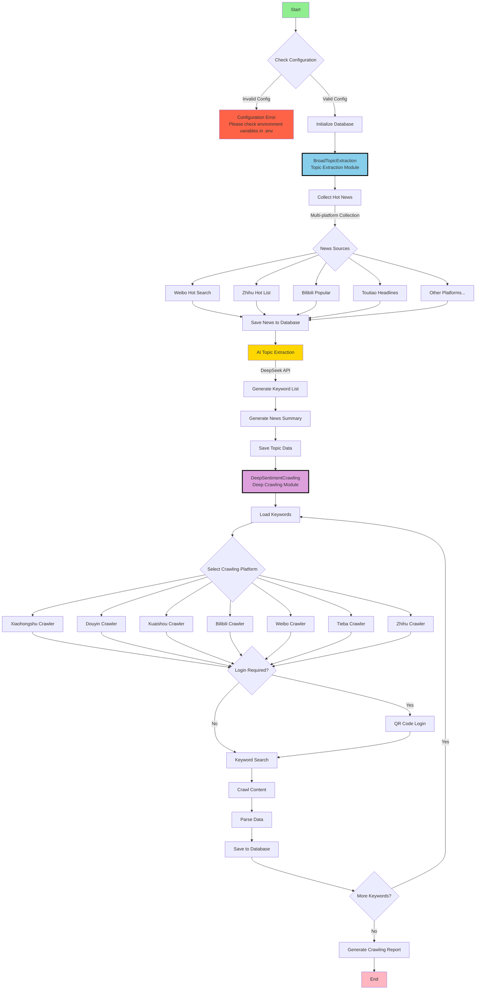

# MindSpider - AI Crawler Designed for Public Opinion Analysis

> Disclaimer:
> All content in this repository is for learning and reference purposes only, commercial use is prohibited. No individual or organization may use the content of this repository for illegal purposes or to infringe upon the legitimate rights and interests of others. The web scraping technology involved in this repository is for learning and research purposes only and must not be used for large-scale scraping of other platforms or other illegal activities. This repository assumes no legal responsibility for any legal consequences arising from the use of its content. Use of this repository's content indicates your agreement to all terms and conditions of this disclaimer.

## Project Overview

MindSpider is an intelligent public opinion analysis crawler system based on Agent technology. It automatically identifies hot topics through AI and performs precise content crawling across multiple social media platforms. The system adopts a modular design, enabling a fully automated workflow from topic discovery to content collection.

This component learns from and references the well-known GitHub crawler project [MediaCrawler](https://github.com/NanmiCoder/MediaCrawler)

Two-step crawling approach:

- Module 1: Search Agent identifies hot news from **13** social media platforms and technical forums including Weibo, Zhihu, GitHub, Coolapk, etc., and maintains a daily topic analysis table.
- Module 2: Full-platform crawler performs deep crawling of fine-grained public opinion feedback for each topic.

<div align="center">


MindSpider Running Example
</div>

### Technical Architecture

- **Programming Language**: Python 3.9+
- **AI Framework**: Default Deepseek, can connect to multiple APIs (topic extraction and analysis)
- **Crawler Framework**: Playwright (browser automation)
- **Database**: MySQL (data persistence storage)
- **Concurrency**: AsyncIO (asynchronous concurrent crawling)

## Project Structure

```
MindSpider/
├── BroadTopicExtraction/           # Topic extraction module
│   ├── database_manager.py         # Database manager
│   ├── get_today_news.py          # News collector
│   ├── main.py                    # Module main entry
│   └── topic_extractor.py         # AI topic extractor
│
├── DeepSentimentCrawling/         # Deep crawling module
│   ├── keyword_manager.py         # Keyword manager
│   ├── main.py                   # Module main entry
│   ├── platform_crawler.py       # Platform crawler manager
│   └── MediaCrawler/             # Multi-platform crawler core
│       ├── base/                 # Base classes
│       ├── cache/                # Cache system
│       ├── config/               # Configuration files
│       ├── media_platform/       # Platform implementations
│       │   ├── bilibili/        # Bilibili crawler
│       │   ├── douyin/          # Douyin crawler
│       │   ├── kuaishou/        # Kuaishou crawler
│       │   ├── tieba/           # Tieba crawler
│       │   ├── weibo/           # Weibo crawler
│       │   ├── xhs/             # Xiaohongshu crawler
│       │   └── zhihu/           # Zhihu crawler
│       ├── model/               # Data models
│       ├── proxy/               # Proxy management
│       ├── store/               # Storage layer
│       └── tools/               # Toolset
│
├── schema/                       # Database schema
│   ├── db_manager.py            # Database manager
│   ├── init_database.py         # Initialization script
│   └── mindspider_tables.sql    # Table structure definition
│
├── config.py                    # Global configuration file
├── main.py                      # System main entry
├── requirements.txt             # Dependencies list
└── README.md                    # Project documentation
```

## System Workflow

### Overall Architecture Flowchart



### Workflow Description

#### 1. BroadTopicExtraction (Topic Extraction Module)

This module is responsible for automatic discovery and extraction of daily hot topics:

1. **News Collection**: Automatically collects hot news from multiple mainstream platforms (Weibo, Zhihu, Bilibili, etc.)
2. **AI Analysis**: Uses DeepSeek API for intelligent news analysis
3. **Topic Extraction**: Automatically identifies hot topics and generates related keywords
4. **Data Storage**: Saves topics and keywords to MySQL database

#### 2. DeepSentimentCrawling (Deep Crawling Module)

Performs deep content crawling on major social platforms based on extracted topic keywords:

1. **Keyword Loading**: Reads keywords extracted for the day from database
2. **Platform Crawling**: Uses Playwright for automated crawling on 7 major platforms
3. **Content Parsing**: Extracts posts, comments, interaction data, etc.
4. **Sentiment Analysis**: Performs sentiment tendency analysis on crawled content
5. **Data Persistence**: Structured storage of all data to database

## Database Architecture

### Core Data Tables

1. **daily_news** - Daily news table
   - Stores hot news collected from various platforms
   - Contains title, link, description, ranking and other information

2. **daily_topics** - Daily topics table
   - Stores AI-extracted topics and keywords
   - Contains topic name, description, keyword list, etc.

3. **topic_news_relation** - Topic-news relationship table
   - Records relationship between topics and news
   - Contains relevance scores

4. **crawling_tasks** - Crawling tasks table
   - Manages crawling tasks for each platform
   - Records task status, progress, results, etc.

5. **Platform content tables** (inherited from MediaCrawler)
   - xhs_note - Xiaohongshu notes (temporarily deprecated, see: https://github.com/NanmiCoder/MediaCrawler/issues/754)
   - douyin_aweme - Douyin videos
   - kuaishou_video - Kuaishou videos
   - bilibili_video - Bilibili videos
   - weibo_note - Weibo posts
   - tieba_note - Tieba posts
   - zhihu_content - Zhihu content

## Installation and Deployment

### Environment Requirements

- Python 3.9 or higher
- MySQL 5.7 or higher, or PostgreSQL
- Conda environment: pytorch_python11 (recommended)
- Operating system: Windows/Linux/macOS


### 1. Clone Project

```bash
git clone https://github.com/yourusername/MindSpider.git
cd MindSpider
```

### 2. Create and Activate Environment

#### Conda Configuration Method

```bash
# Create conda environment named pytorch_python11 and specify Python version
conda create -n pytorch_python11 python=3.11
# Activate the environment
conda activate pytorch_python11
```

#### UV Configuration Method

> [UV is a fast, lightweight Python package environment management tool suitable for low-dependency and convenient management needs. Reference: https://github.com/astral-sh/uv]

- Install uv (if not installed)
```bash
pip install uv
```
- Create virtual environment and activate
```bash
uv venv --python 3.11 # Create 3.11 environment
source .venv/bin/activate   # Linux/macOS
# or
.venv\Scripts\activate      # Windows
```


### 3. Install Dependencies

```bash
# Install Python dependencies
pip install -r requirements.txt

or
# uv version is faster
uv pip install -r requirements.txt


# Install Playwright browser drivers
playwright install
```

### 4. Configure System

Copy .env.example file to .env file and place it in project root directory. Edit `.env` file to set database and API configuration:

```python
# MySQL database configuration
DB_HOST = "your_database_host"
DB_PORT = 3306
DB_USER = "your_username"
DB_PASSWORD = "your_password"
DB_NAME = "mindspider"
DB_CHARSET = "utf8mb4"

# MINDSPIDER API keys
MINDSPIDER_BASE_URL=your_api_base_url
MINDSPIDER_API_KEY=sk-your-key
MINDSPIDER_MODEL_NAME=deepseek-chat
```

### 5. Initialize System

```bash
# Check system status
python main.py --status
```

## Usage Guide

### Complete Workflow

```bash
# 1. Run topic extraction (get hot news and keywords)
python main.py --broad-topic

# 2. Run crawler (crawl platform content based on keywords)
python main.py --deep-sentiment --test

# Or run complete workflow at once
python main.py --complete --test
```

### Individual Module Usage

```bash
# Only get today's hot topics and keywords
python main.py --broad-topic

# Only crawl specific platforms
python main.py --deep-sentiment --platforms xhs dy --test

# Specify date
python main.py --broad-topic --date 2024-01-15
```

## Crawler Configuration (Important)

### Platform Login Configuration

**First-time use of each platform requires login, this is the most critical step:**

1. **Xiaohongshu Login** (temporarily deprecated, see: https://github.com/NanmiCoder/MediaCrawler/issues/754)
```bash
# Test Xiaohongshu crawling (QR code will pop up)
python main.py --deep-sentiment --platforms xhs --test
# Scan QR code with Xiaohongshu APP to login, status will be automatically saved after successful login
```

2. **Douyin Login**
```bash
# Test Douyin crawling
python main.py --deep-sentiment --platforms dy --test
# Scan QR code with Douyin APP to login
```

3. **Other Platforms Similarly**
```bash
# Kuaishou
python main.py --deep-sentiment --platforms ks --test

# Bilibili
python main.py --deep-sentiment --platforms bili --test

# Weibo
python main.py --deep-sentiment --platforms wb --test

# Tieba
python main.py --deep-sentiment --platforms tieba --test

# Zhihu
python main.py --deep-sentiment --platforms zhihu --test
```

### Login Troubleshooting

**If login fails or gets stuck:**

1. **Check Network**: Ensure normal access to corresponding platform
2. **Disable Headless Mode**: Edit `DeepSentimentCrawling/MediaCrawler/config/base_config.py`
   ```python
   HEADLESS = False  # Change to False to see browser interface
   ```
3. **Manual Verification**: Some platforms may require manual sliding captcha verification
4. **Re-login**: Delete `DeepSentimentCrawling/MediaCrawler/browser_data/` directory to re-login

### Other Issues

https://github.com/666ghj/BettaFish/issues/185

### Crawling Parameter Adjustment

It is recommended to adjust crawling parameters before actual use:

```bash
# Small-scale testing (recommended to test this way first)
python main.py --complete --test

# Adjust crawling quantity
python main.py --complete --max-keywords 20 --max-notes 30
```

### Advanced Features

#### 1. Specify Date Operations
```bash
# Extract topics for specified date
python main.py --broad-topic --date 2024-01-15

# Crawl content for specified date
python main.py --deep-sentiment --date 2024-01-15
```

#### 2. Specify Platform Crawling
```bash
# Only crawl Bilibili and Douyin
python main.py --deep-sentiment --platforms bili dy --test

# Crawl specific quantity of content from all platforms
python main.py --deep-sentiment --max-keywords 30 --max-notes 20
```

## Common Parameters

```bash
--status              # Check project status
--setup               # Initialize project (deprecated, now auto-initialized)
--broad-topic         # Topic extraction
--deep-sentiment      # Crawler module
--complete            # Complete workflow
--test                # Test mode (small amount of data)
--platforms xhs dy    # Specify platforms
--date 2024-01-15     # Specify date
```

## Supported Platforms

| Code | Platform | Code | Platform |
|-----|---------|-----|---------|
| xhs | Xiaohongshu | wb | Weibo |
| dy | Douyin | tieba | Tieba |
| ks | Kuaishou | zhihu | Zhihu |
| bili | Bilibili | | |

## Common Issues

### 1. Crawler Login Failure
```bash
# Problem: QR code not displayed or login failure
# Solution: Disable headless mode, manual login
# Edit: DeepSentimentCrawling/MediaCrawler/config/base_config.py
HEADLESS = False

# Re-run login
python main.py --deep-sentiment --platforms xhs --test
```

### 2. Database Connection Failure
```bash
# Check configuration
python main.py --status

# Check if database configuration in config.py is correct
```

### 3. playwright Installation Failure
```bash
# Reinstall
pip install playwright

or

uv pip install playwright

playwright install
```

### 4. Crawled Data is Empty
- Ensure platform login was successful
- Check if keywords exist (run topic extraction first)
- Verify using test mode: `--test`

### 5. API Call Failure
- Check if DeepSeek API key is correct
- Confirm if API quota is sufficient

## Important Notes

1. **First-time use requires login to each platform**
2. **Recommend verifying with test mode first**
3. **Comply with platform usage rules**
4. **For learning and research purposes only**

## Project Development Guide

### Extending New News Sources

Add new news sources in `BroadTopicExtraction/get_today_news.py`:

```python
async def get_new_platform_news(self) -> List[Dict]:
    """Get hot news from new platform"""
    # Implement news collection logic
    pass
```

### Extending New Crawler Platforms

1. Create new platform directory under `DeepSentimentCrawling/MediaCrawler/media_platform/`
2. Implement core functionality modules for the platform:
   - `client.py`: API client
   - `core.py`: Crawler core logic
   - `login.py`: Login logic
   - `field.py`: Data field definitions

### Database Extension

To add new data tables or fields, please update `schema/mindspider_tables.sql` and run:

```bash
python schema/init_database.py
```

## Performance Optimization Recommendations

1. **Database Optimization**
   - Regularly clean historical data
   - Create indexes for frequently queried fields
   - Consider using partitioned tables to manage large amounts of data

2. **Crawling Optimization**
   - Set reasonable crawling intervals to avoid being restricted
   - Use proxy pools to improve stability
   - Control concurrency to avoid resource exhaustion

3. **System Optimization**
   - Use Redis to cache hot data
   - Asynchronous task queues to handle time-consuming operations
   - Regularly monitor system resource usage

## API Interface Description

The system provides Python API for secondary development:

```python
from BroadTopicExtraction import BroadTopicExtraction
from DeepSentimentCrawling import DeepSentimentCrawling

# Topic extraction
async def extract_topics():
    extractor = BroadTopicExtraction()
    result = await extractor.run_daily_extraction()
    return result

# Content crawling
def crawl_content():
    crawler = DeepSentimentCrawling()
    result = crawler.run_daily_crawling(
        platforms=['xhs', 'dy'],
        max_keywords=50,
        max_notes=30
    )
    return result
```

## License

This project is for learning and research purposes only, please do not use for commercial purposes. When using this project, please comply with relevant laws, regulations and platform service terms.

---

**MindSpider** - Let AI assist in public opinion insights, an intelligent content analysis assistant
