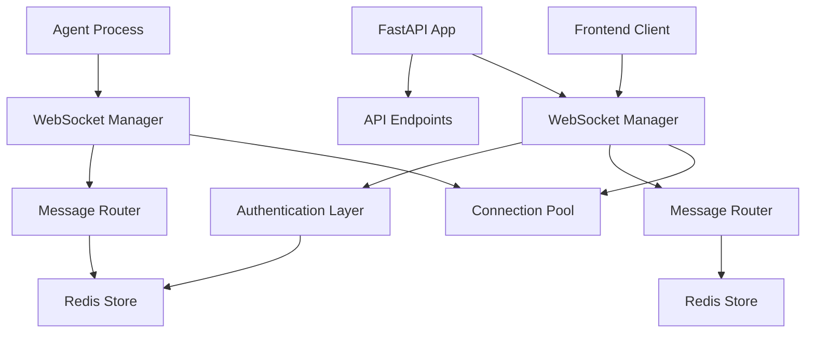

# WebSocket Communication Design for BettaFish

## Overview

This document outlines the WebSocket communication system for the FastAPI-based BettaFish backend, replacing Flask-SocketIO with native WebSockets for better performance and scalability.

## Architecture

### Connection Management


### Connection Flow
1. **Frontend Connection**: Client connects to `/ws/frontend` endpoint
2. **Agent Connection**: Each agent process connects to `/ws/agents/{agent_type}` endpoint
3. **Authentication**: WebSocket connections validated via JWT tokens or session IDs
4. **Message Routing**: Messages routed based on type and destination
5. **Persistence**: Connection state stored in Redis for scalability

## Message Types

### 1. System Messages
```json
{
  "type": "system",
  "action": "status_update" | "shutdown" | "restart",
  "data": {
    "system_status": "running",
    "agents": [
      {
        "type": "insight",
        "status": "running",
        "port": 8501
      }
    ]
  }
}
```

### 2. Agent Log Messages
```json
{
  "type": "agent_log",
  "agent_type": "insight" | "media" | "query" | "forum",
  "data": {
    "level": "info" | "warning" | "error",
    "message": "Starting database search...",
    "timestamp": "2024-01-01T12:00:00Z",
    "metadata": {
      "search_query": "public opinion analysis",
      "result_count": 150
    }
  }
}
```

### 3. Forum Discussion Messages
```json
{
  "type": "forum_message",
  "data": {
    "discussion_id": "disc_123456",
    "sender": "HOST" | "INSIGHT" | "MEDIA" | "QUERY",
    "content": "Based on the search results, I recommend focusing on...",
    "timestamp": "2024-01-01T12:00:00Z",
    "metadata": {
      "round": 2,
      "context": "initial_analysis"
    }
  }
}
```

### 4. Command Messages
```json
{
  "type": "command",
  "target": "agent_type" | "system",
  "action": "start" | "stop" | "restart" | "configure",
  "data": {
    "agent_type": "insight",
    "config": {
      "max_reflections": 3,
      "search_timeout": 300
    }
  }
}
```

## Implementation Details

### 1. WebSocket Manager
```python
# backend/services/websocket_manager.py
import asyncio
import json
from typing import Dict, List, Set
from datetime import datetime
import redis.asyncio as redis

from ..core.config import settings
from ..models.common import WebSocketMessage

class WebSocketManager:
    def __init__(self):
        # Connection pools
        self.frontend_connections: Set[WebSocket] = set()
        self.agent_connections: Dict[str, Set[WebSocket]] = {}
        
        # Redis for connection state
        self.redis = redis.from_url(settings.REDIS_URL)
        
        # Message queues
        self.message_queue = asyncio.Queue()
        
        # Connection tracking
        self.connection_metadata: Dict[str, Dict] = {}
    
    async def connect_frontend(self, websocket: WebSocket):
        """Connect frontend client"""
        await websocket.accept()
        self.frontend_connections.add(websocket)
        
        connection_id = f"frontend_{id(websocket)}"
        await self._store_connection_metadata(connection_id, {
            "type": "frontend",
            "connected_at": datetime.utcnow(),
            "user_id": None  # Set after authentication
        })
        
        # Send initial state
        await self._send_to_frontend(websocket, {
            "type": "system",
            "action": "connection_established",
            "data": {"connection_id": connection_id}
        })
    
    async def connect_agent(self, websocket: WebSocket, agent_type: str):
        """Connect agent process"""
        await websocket.accept()
        
        if agent_type not in self.agent_connections:
            self.agent_connections[agent_type] = set()
        
        self.agent_connections[agent_type].add(websocket)
        
        connection_id = f"agent_{agent_type}_{id(websocket)}"
        await self._store_connection_metadata(connection_id, {
            "type": "agent",
            "agent_type": agent_type,
            "connected_at": datetime.utcnow()
        })
        
        # Notify frontend
        await self._broadcast_to_frontend({
            "type": "system",
            "action": "agent_connected",
            "data": {
                "agent_type": agent_type,
                "connection_id": connection_id
            }
        })
    
    async def disconnect_frontend(self, websocket: WebSocket):
        """Disconnect frontend client"""
        self.frontend_connections.discard(websocket)
        
        # Clean up connection metadata
        await self._cleanup_connection_metadata(f"frontend_{id(websocket)}")
    
    async def disconnect_agent(self, websocket: WebSocket, agent_type: str):
        """Disconnect agent process"""
        if agent_type in self.agent_connections:
            self.agent_connections[agent_type].discard(websocket)
        
        # Notify frontend if no more connections for this agent type
        if not self.agent_connections[agent_type]:
            await self._broadcast_to_frontend({
                "type": "system",
                "action": "agent_disconnected",
                "data": {
                    "agent_type": agent_type,
                    "remaining_connections": 0
                }
            })
    
    async def send_to_agent(self, agent_type: str, message: dict):
        """Send message to specific agent type"""
        if agent_type not in self.agent_connections or not self.agent_connections[agent_type]:
            return False
        
        # Send to all connections for this agent type
        message_data = json.dumps(message)
        disconnected = set()
        
        for connection in list(self.agent_connections[agent_type]):
            try:
                await connection.send(message_data)
            except Exception as e:
                disconnected.add(connection)
        
        # Remove disconnected connections
        self.agent_connections[agent_type] -= disconnected
        
        return len(self.agent_connections[agent_type]) > 0
    
    async def broadcast_to_frontend(self, message: dict):
        """Broadcast message to all frontend connections"""
        if not self.frontend_connections:
            return
        
        message_data = json.dumps(message)
        disconnected = set()
        
        for connection in list(self.frontend_connections):
            try:
                await connection.send(message_data)
            except Exception as e:
                disconnected.add(connection)
        
        # Remove disconnected connections
        self.frontend_connections -= disconnected
    
    async def broadcast_agent_log(self, agent_type: str, log_data: dict):
        """Broadcast agent log to frontend"""
        message = {
            "type": "agent_log",
            "agent_type": agent_type,
            "data": log_data
        }
        await self.broadcast_to_frontend(message)
    
    async def _store_connection_metadata(self, connection_id: str, metadata: dict):
        """Store connection metadata in Redis"""
        await self.redis.setex(
            f"ws:conn:{connection_id}",
            json.dumps(metadata),
            3600  # 1 hour expiry
        )
    
    async def _cleanup_connection_metadata(self, connection_id: str):
        """Clean up connection metadata from Redis"""
        await self.redis.delete(f"ws:conn:{connection_id}")
```

### 2. WebSocket Endpoints
```python
# backend/api/websocket.py
from fastapi import APIRouter, WebSocket, WebSocketDisconnect, Depends
from typing import Dict, Any

from ..core.database import get_prisma
from ..services.websocket_manager import manager
from ..services.auth_service import get_current_user
from ..models.common import WebSocketMessage

router = APIRouter(prefix="/ws", tags=["websocket"])

@router.websocket("/frontend")
async def websocket_frontend_endpoint(
    websocket: WebSocket,
    user: dict = Depends(get_current_user)
):
    """WebSocket endpoint for frontend clients"""
    await manager.connect_frontend(websocket)
    
    try:
        while True:
            # Receive message from frontend
            data = await websocket.receive_text()
            message = WebSocketMessage.parse_raw(data)
            
            # Handle different message types
            if message.type == "command":
                await handle_frontend_command(message, user)
            elif message.type == "auth":
                await handle_frontend_auth(message, websocket)
            # Add more message type handlers as needed
            
    except WebSocketDisconnect:
        await manager.disconnect_frontend(websocket)

@router.websocket("/agents/{agent_type}")
async def websocket_agent_endpoint(
    websocket: WebSocket,
    agent_type: str,
    api_key: str = Depends(validate_api_key)
):
    """WebSocket endpoint for agent processes"""
    # Validate API key for agent connection
    await manager.connect_agent(websocket, agent_type)
    
    try:
        while True:
            # Receive log data from agent
            data = await websocket.receive_text()
            message = WebSocketMessage.parse_raw(data)
            
            # Broadcast agent logs to frontend
            if message.type == "agent_log":
                await manager.broadcast_agent_log(agent_type, message.data)
            # Handle other message types
            
    except WebSocketDisconnect:
        await manager.disconnect_agent(websocket, agent_type)
```

### 3. Message Processing
```python
# backend/services/message_processor.py
import asyncio
from typing import Dict, Any, List
from datetime import datetime

from ..core.database import get_prisma
from ..services.websocket_manager import manager
from ..models.agent import AgentStatus
from ..services.forum_service import ForumService

class MessageProcessor:
    def __init__(self, prisma):
        self.prisma = prisma
        self.forum_service = ForumService(prisma)
    
    async def process_frontend_command(self, message: dict, user: dict):
        """Process commands from frontend"""
        command = message.get("command")
        target = message.get("target")
        data = message.get("data", {})
        
        if command == "start_agent" and target:
            await self._handle_start_agent(target, data, user)
        elif command == "stop_agent" and target:
            await self._handle_stop_agent(target, user)
        elif command == "restart_agent" and target:
            await self._handle_restart_agent(target, user)
        elif command == "configure_agent" and target:
            await self._handle_configure_agent(target, data, user)
        # Add more command handlers
    
    async def _handle_start_agent(self, agent_type: str, data: dict, user: dict):
        """Handle agent start command"""
        # Check permissions
        if not await self._check_agent_permission(user, agent_type, "start"):
            await manager.broadcast_to_frontend({
                "type": "error",
                "message": f"Permission denied for starting {agent_type} agent"
            })
            return
        
        # Update agent status in database
        await self.prisma.agent.update(
            where={"type": agent_type},
            data={
                "status": AgentStatus.STARTING,
                "updatedAt": datetime.utcnow()
            }
        )
        
        # Send start command to agent
        await manager.send_to_agent(agent_type, {
            "type": "command",
            "action": "start",
            "data": data
        })
    
    async def _handle_stop_agent(self, agent_type: str, data: dict, user: dict):
        """Handle agent stop command"""
        # Check permissions
        if not await self._check_agent_permission(user, agent_type, "stop"):
            await manager.broadcast_to_frontend({
                "type": "error",
                "message": f"Permission denied for stopping {agent_type} agent"
            })
            return
        
        # Update agent status in database
        await self.prisma.agent.update(
            where={"type": agent_type},
            data={
                "status": AgentStatus.STOPPED,
                "updatedAt": datetime.utcnow()
            }
        )
        
        # Send stop command to agent
        await manager.send_to_agent(agent_type, {
            "type": "command",
            "action": "stop",
            "data": data
        })
```

### 4. Frontend Integration

#### TypeScript WebSocket Client
```typescript
// frontend/src/lib/websocket.ts
import { useEffect, useRef, useState, useCallback } from 'react'

export class WebSocketClient {
  private ws: WebSocket | null = null
  private url: string
  private reconnectAttempts = 0
  private maxReconnectAttempts = 5
  private reconnectDelay = 1000
  
  constructor(url: string) {
    this.url = url
  }
  
  connect() {
    if (this.ws?.readyState === WebSocket.OPEN) {
      return
    }
    
    this.ws = new WebSocket(this.url)
    
    this.ws.onopen = () => {
      console.log('WebSocket connected')
      this.reconnectAttempts = 0
    }
    
    this.ws.onmessage = (event) => {
      const message = JSON.parse(event.data)
      this.handleMessage(message)
    }
    
    this.ws.onclose = () => {
      console.log('WebSocket disconnected')
      this.scheduleReconnect()
    }
    
    this.ws.onerror = (error) => {
      console.error('WebSocket error:', error)
    }
  }
  
  private scheduleReconnect() {
    if (this.reconnectAttempts < this.maxReconnectAttempts) {
      setTimeout(() => {
        this.reconnectAttempts++
        this.connect()
      }, this.reconnectDelay)
    }
  }
  
  private handleMessage(message: any) {
    // Handle different message types
    switch (message.type) {
      case 'system':
        this.handleSystemMessage(message)
        break
      case 'agent_log':
        this.handleAgentLogMessage(message)
        break
      case 'forum_message':
        this.handleForumMessage(message)
        break
      case 'error':
        this.handleErrorMessage(message)
        break
      default:
        console.warn('Unknown message type:', message.type)
    }
  }
  
  private handleSystemMessage(message: any) {
    // Handle system status updates, agent connection events, etc.
    console.log('System message:', message)
  }
  
  private handleAgentLogMessage(message: any) {
    // Handle agent log messages
    console.log(`Agent ${message.agent_type}:`, message.data)
  }
  
  private handleForumMessage(message: any) {
    // Handle forum discussion messages
    console.log('Forum message:', message)
  }
  
  private handleErrorMessage(message: any) {
    // Handle error messages
    console.error('Error:', message)
  }
  
  sendCommand(type: string, target: string, action: string, data?: any) {
    if (this.ws?.readyState === WebSocket.OPEN) {
      this.ws.send(JSON.stringify({
        type: 'command',
        target,
        action,
        data,
        timestamp: new Date().toISOString()
      }))
    }
  }
  
  disconnect() {
    if (this.ws) {
      this.ws.close()
      this.ws = null
    }
  }
}

// React Hook
export function useWebSocket(url: string) {
  const client = useRef<WebSocketClient | null>(null)
  const [isConnected, setIsConnected] = useState(false)
  const [lastMessage, setLastMessage] = useState<any>(null)
  
  useEffect(() => {
    client.current = new WebSocketClient(url)
    client.current.connect()
    
    setIsConnected(true)
    
    return () => {
      client.current?.disconnect()
      setIsConnected(false)
    }
  }, [url])
  
  const sendMessage = useCallback((message: any) => {
    client.current?.sendCommand('custom', 'system', 'message', message)
  }, [])
  
  return { isConnected, lastMessage, sendMessage }
}
```

### 5. Performance Optimizations

#### Connection Pooling
- Limit concurrent connections per agent type
- Implement connection health checks
- Use connection timeouts and cleanup

#### Message Queuing
- Implement message priority queues
- Batch messages for better performance
- Use Redis for message persistence

#### Scalability
- Horizontal scaling with multiple WebSocket servers
- Load balancing across server instances
- Redis pub/sub for multi-server communication

This WebSocket design provides a robust, scalable real-time communication system for BettaFish, enabling efficient agent coordination and frontend updates with proper error handling and performance optimizations.